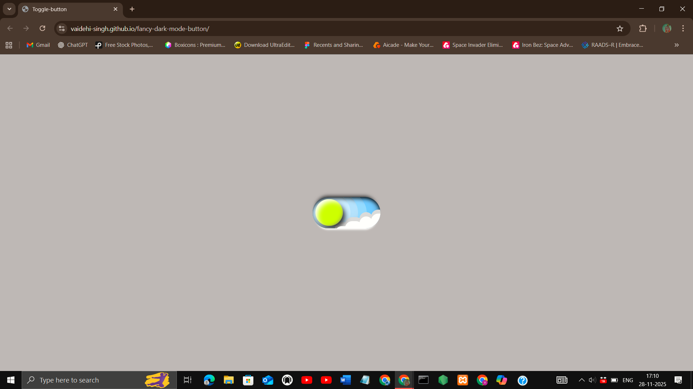
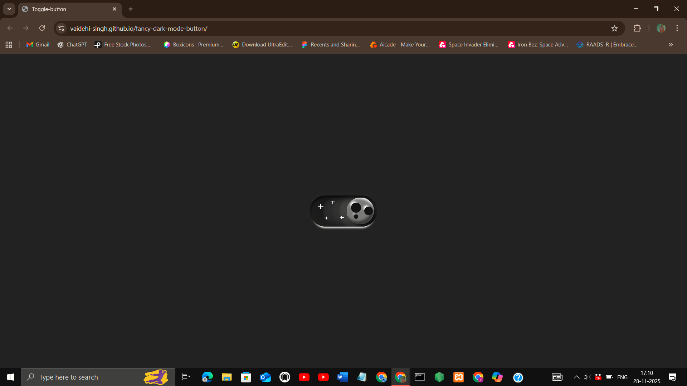

## Project Title
Fancy Dark Mode Button

## Description
A stylish dark mode toggle button with smooth transitions and modern design flair. The button not only switches between light and dark themes but also adds a touch of elegance with animated effects, glowing highlights, and a polished UI feel. It demonstrates how to implement theme switching in a visually engaging way.

## Features
- Responsive design (mobile, tablet, desktop)
- Smooth animations and transitions
- Clean, modern UI
- Interactive hover effects

## Demo
[Live Demo](https://vaidehi-singh.github.io/fancy-dark-mode-button/)

## Screenshots



## Tech Stack
- HTML
- CSS
- JavaScript

## How to Use
 1. Clone the repo  
   ```bash
   git clone https://github.com/vaidehi-singh/fancy-dark-mode-button.git
   cd fancy-dark-mode-button
   ```
 2. Open index.html in your browser.

## Author
Designed and developed by **Vaidehi Singh**  
[GitHub Profile](https://github.com/vaidehi-singh)
